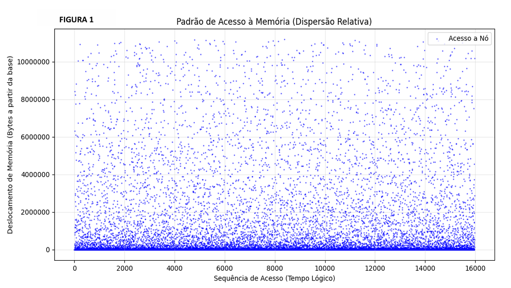
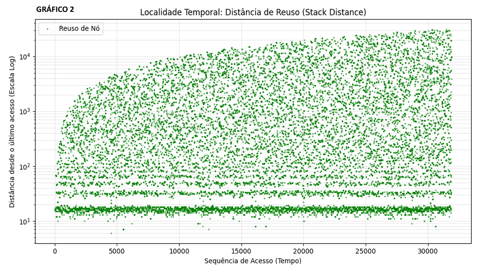
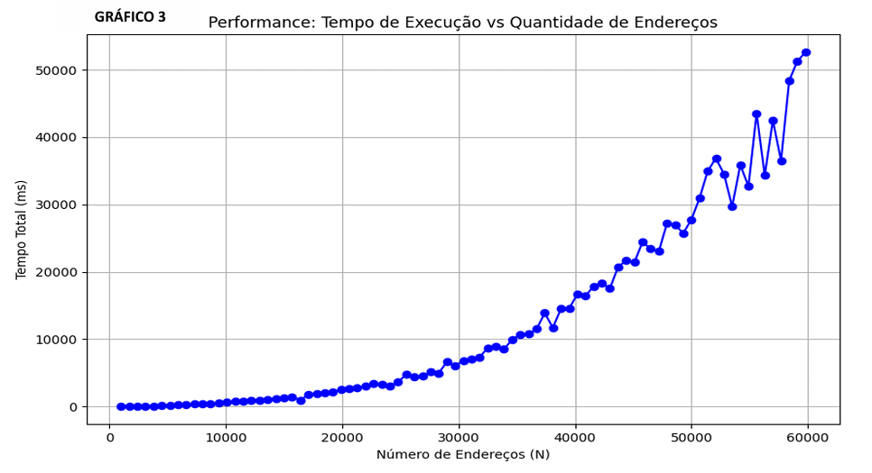

<<<<<<< HEAD
# Sistema-de-Consultas-Log-sticas-CabeAi-Trabalho-Pratico-3
Trabalho Prático 3 da disciplina de Estrutura de Dados
=======
# Sistema-de-Consultas-Logísticas-CabeAi-TP3

Trabalho Prático III da disciplina de **Estrutura de Dados** (UFMG)

---

## Sobre o Projeto

Este projeto implementa um **Motor de Busca Geoespacial** capaz de processar uma base massiva de endereços e realizar consultas eficientes por logradouros utilizando termos parciais e proximidade geográfica.

O sistema opera em três estágios principais:
1.  **Consolidação:** Processa registros brutos de endereços, unificando-os em "Logradouros Únicos" e calculando seu centro de gravidade (latitude/longitude médias).
2.  **Indexação:** Constrói um **Índice Invertido** utilizando uma **Árvore AVL**, mapeando cada palavra existente nos nomes das ruas para a lista de logradouros onde ela ocorre.
3.  **Consulta:** Realiza a interseção dos conjuntos de resultados para encontrar logradouros que contenham *todas* as palavras buscadas, ordenando-os pela distância Euclidiana em relação à posição do usuário.

---

## Algoritmos e Estruturas de Dados

O projeto foi desenvolvido em **C++** (padrão C++11), utilizando Tipos Abstratos de Dados (TADs) e gerenciamento manual de memória (sem uso de `std::vector` ou `std::map`).

### 1. Árvore AVL (Índice Invertido)
Para garantir buscas rápidas mesmo com palavras muito frequentes (como "RUA" ou "SILVA"), utilizou-se uma Árvore Binária de Busca Balanceada (AVL).
* **Complexidade de Busca:** $O(\log P)$, onde $P$ é o número de palavras únicas.
* **Balanceamento:** Rotações simples e duplas garantem que a altura da árvore permaneça logarítmica, evitando a degeneração.

### 2. Merge Sort (Pré-processamento)
Para consolidar os endereços brutos em logradouros únicos, foi aplicado o **Merge Sort** ($O(N \log N)$) para ordenar os dados por ID. Isso permitiu utilizar a técnica de "quebra de controle" para agrupar registros sequenciais e calcular as coordenadas médias eficientemente.

### Análise de Complexidade

| Componente | Algoritmo / Estrutura | Complexidade de Tempo | Complexidade de Espaço |
| :--- | :--- | :--- | :--- |
| **Ordenação Inicial** | Merge Sort | $O(N \log N)$ | $O(N)$ |
| **Indexação** | Inserção na AVL | $O(P \log P)$ | $O(P + \text{Ocorrências})$ |
| **Busca (Pior Caso)** | Interseção de Listas | $O(R^2)$ | $O(R)$ |
| **Custo Global** | Pré-processamento dominante | $O(N \log N)$ | $O(N + P)$ |

*Onde $N$ é o total de endereços, $P$ o número de palavras únicas e $R$ o número de resultados de uma busca.*

---

## 📂 Estrutura de Diretórios

~~~bash
TP3/
├── src/          # Código fonte (.cpp) - Main, Consulta, Palavra (AVL), etc.
├── include/      # Cabeçalhos (.h) - Definições dos TADs
├── bin/          # Executável final (tp3.out)
├── obj/          # Arquivos objeto de compilação
├── assets/       # Gráficos de análise experimental
└── Makefile      # Automação da compilação
~~~

---

## ⚙️ Compilação e Execução

### Pré-requisitos
* Compilador **G++** (suporte a C++11)
* Ambiente Linux

### Como Compilar
Na raiz do projeto, execute:

~~~bash
make all
~~~

### Como Executar
O programa lê a base de dados e as consultas da entrada padrão (**stdin**).

~~~bash
./bin/tp3.out < input.txt
~~~

### Formato de Entrada
O arquivo contém a configuração da base de endereços seguida pelas consultas:

~~~plaintext
# Exemplo simplificado
<NumEnderecos>
<IdEnd>; <IdLog>; <Tipo>; <NomeLogradouro>; ...; <Lat>; <Long>
...
<NumConsultas> <MaxResultados>
<IdConsulta>; <Termos da Busca>; <LatUsuario>; <LongUsuario>
~~~

---

## 📊 Resultados Experimentais

Os testes de estresse demonstraram os limites práticos da implementação em relação ao hardware.

* **Padrão de Acesso à Memória:** O gráfico de dispersão mostrou uma alta densidade de acesso nos nós superiores da AVL (raiz), confirmando a eficiência da cache para o início das buscas.

* **Limites de Cache:** Para bases acima de **40.000 endereços**, observou-se uma degradação de performance e oscilação no tempo de execução. Isso ocorre devido à fragmentação de memória causada pelos ponteiros da árvore, gerando *Cache Misses* frequentes ao acessar folhas profundas.

### Gráfico de Performance
#### 📈 Tempo de Execução vs. Tamanho da Base

*(O crescimento torna-se instável após 40k registros devido à latência da memória principal)*

---

## Autoria e Licença

Este projeto foi desenvolvido por **Marcos Aurelio Santos** como parte da avaliação da disciplina de Estruturas de Dados da UFMG.

**Contato:** [LinkedIn](https://www.linkedin.com/in/marcos9247)

© 2025 Marcos Aurelio Santos. Código disponível para fins acadêmicos.
>>>>>>> 45a2e5e (Envio de projeto)
